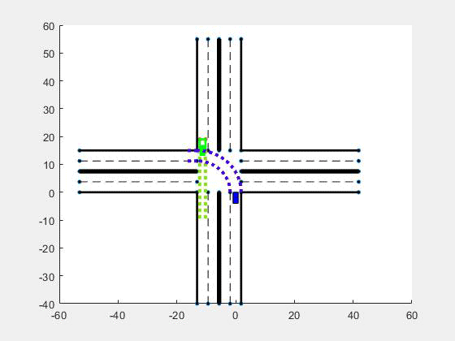
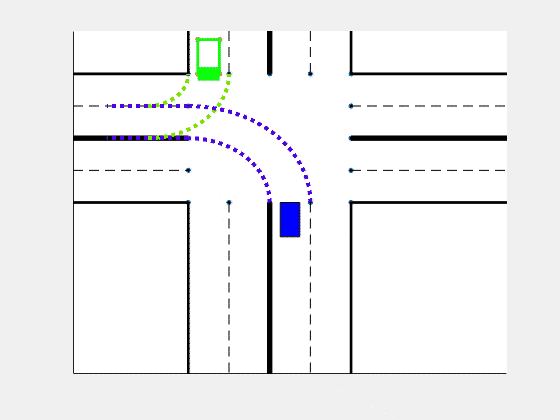

# rightturn_matlab
(cartesian) ego vehicle rightturn, other vehicles turn left and go straight.

(logpolar) ego vehicle turn left and another vehicle goes straight.

(cartesian) ego vehicle turn left and another vehicle goes straight.

(cartesian) ego vehicle turn left and another vehicle turns right.

